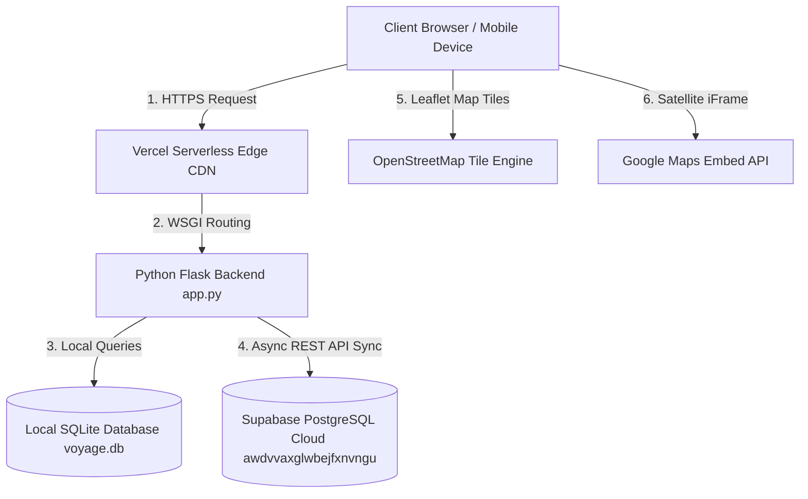
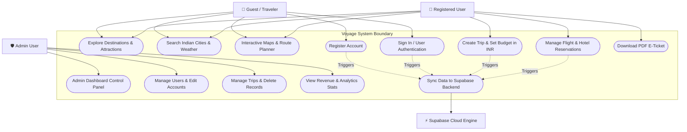
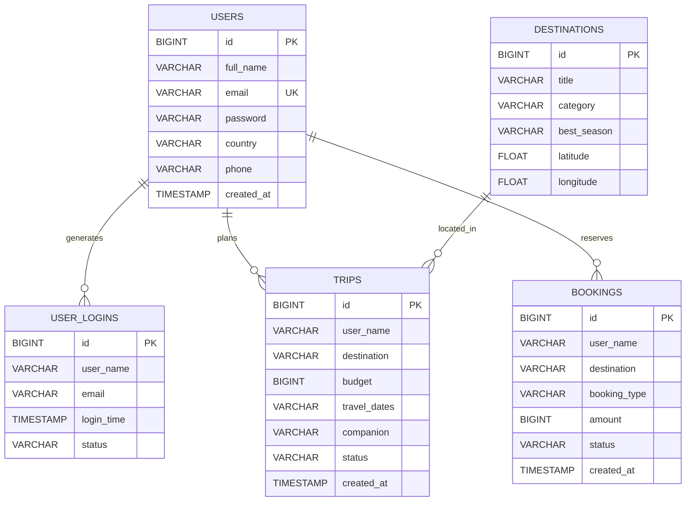
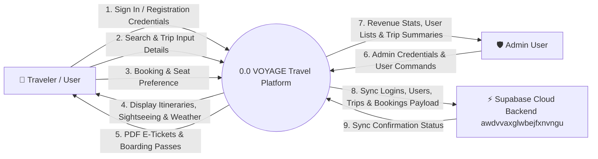
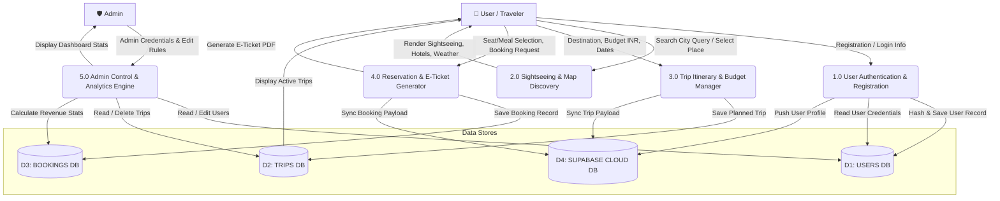
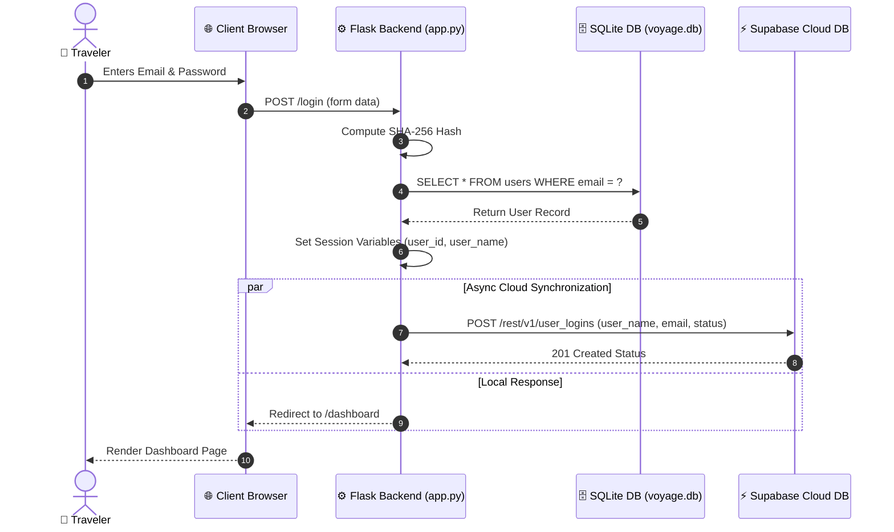
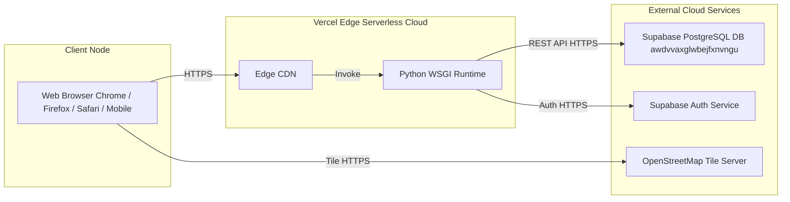

# PROJECT REPORT & SYNOPSIS
## VOYAGE — Travel Planning & Sightseeing Explorer Platform
**Full-Stack Indian Travel Exploration, Budgeting & Cloud Sync Web Platform**  
**Academic Year:** 2026 – 2027  
**Repository:** [pranaykumarsingh06/Mini-Project](https://github.com/pranaykumarsingh06/Mini-Project)  
**Cloud Database Backend:** Supabase PostgreSQL (`awdvvaxglwbejfxnvngu`)  
**Deployment Target:** Vercel Cloud Serverless Platform  

---

## 1. ABSTRACT

The **VOYAGE Travel Web Application** is an end-to-end digital travel planning, itinerary management, sightseeing discovery, and flight/hotel booking platform designed specifically for Indian domestic and international tourism. Built on modern web technologies (Python Flask backend, SQLite3 local database, Supabase PostgreSQL cloud sync, and Leaflet.js / OpenStreetMap mapping engines), VOYAGE solves the fragmentation in traditional travel platforms by combining interactive maps, custom budgeting in Indian Rupees (₹ INR), instant PDF E-Ticket generation, and administrative governance into a single responsive application.

The system incorporates real-time asynchronous synchronization with a Supabase cloud database (`awdvvaxglwbejfxnvngu`), ensuring that every user login, registration, itinerary addition, and booking reservation is persisted securely across serverless cloud environments with zero infrastructure expenditure overhead.

---

## 2. INTRODUCTION & OBJECTIVES

### 2.1 Project Overview
Tourism in India is experiencing rapid growth, yet travelers often struggle with fragmented platforms that separate location discovery, route calculation, budgeting, and reservation management. VOYAGE consolidates these features into an all-in-one web portal with zero learning curve.

### 2.2 Key Project Objectives
- **Comprehensive Indian Location Explorer:** Provide detailed sightseeing guides, top 6 attraction spots, weather forecasts, best visiting seasons, luxury hotels, and local food spots for 12 major Indian cities (Taj Mahal Agra, Goa, Jaipur, Kerala, Leh Ladakh, Udaipur, Varanasi, Rishikesh, Amritsar, Darjeeling, Shimla, Manali).
- **Custom Budgeting Engine:** Allow travelers to set custom budgets in ₹ INR, travel dates, and companion styles (Family, Friends, Couple, Solo).
- **Dual-Engine Interactive Mapping:** Integrate Leaflet.js with OpenStreetMap tiles and Google Maps satellite embeds for 100% map uptime and route calculation.
- **Interactive Reservation & E-Ticket Generator:** Enable 1-click modal management for flight/hotel seat selection, meal preferences, and printable E-Ticket generation with PNR and barcodes.
- **Cloud Data Synchronization:** Persist user logins, registrations, trips, and bookings to a remote Supabase PostgreSQL database.
- **Administrative Control Portal:** Provide a secure admin dashboard (`/admin`) enforcing restricted email authentication (`pranaykrsingh03@gmail.com`) for user and financial analytics management.

---

## 3. LITERATURE SURVEY & COMPARATIVE ANALYSIS

| Feature | Traditional Platforms | Generic Travel Blogs | VOYAGE Platform |
| :--- | :--- | :--- | :--- |
| **Sightseeing & Hotel Discovery** | Separated from maps | Static articles only | **Integrated 1-Click Interactive Guide** |
| **Budget Planning in ₹ INR** | Fixed commercial prices | No budget tools | **Customizable ₹ INR Trip Budgeter** |
| **Cloud Backend Sync** | Proprietary locked DB | None | **Real-Time Supabase PostgreSQL Sync** |
| **Admin Control Panel** | Complex enterprise tools | None | **Minimalist 1-Click Control Portal** |

---

## 4. SYSTEM REQUIREMENTS & SPECIFICATIONS

### 4.1 Software Requirements
- **Operating System:** Windows 10/11, macOS, or Linux
- **Backend Runtime:** Python 3.8+ (Flask Framework 3.0+)
- **Database Engines:** SQLite3 (Local Development) & Supabase PostgreSQL (Cloud Production)
- **Frontend Stack:** HTML5, CSS3, JavaScript (ES6+), Leaflet.js v1.9.4
- **Deployment Target:** Vercel Cloud Serverless Functions

### 4.2 Hardware Requirements
- **Client Processor:** Dual-Core 1.6 GHz or higher
- **Client Memory:** 1 GB RAM minimum (50 MB browser RAM footprint)
- **Network:** Active Internet Connection for Map Tile Loading & Cloud Sync

---

## 5. SYSTEM ARCHITECTURE & DIAGRAMS

### 5.1 System Architecture Diagram

---

### 5.2 Use Case Diagram

---

### 5.3 Entity-Relationship (ER) Diagram

---

### 5.4 Data Flow Diagram (DFD) Level 0 — Context Diagram

---

### 5.5 Data Flow Diagram (DFD) Level 1 — Process Decomposition

---

### 5.6 Sequence Diagram (User Login & Supabase Cloud Sync Flow)

---

### 5.7 Deployment Diagram

---

## 6. MODULE DESCRIPTION

- **Module 1: User Authentication & Security:** Handles registration, login, session guards, and SHA-256 password hashing.
- **Module 2: Destination & Sightseeing Explorer:** Provides comprehensive coverage of 12 Indian tourist destinations with weather, luxury hotels, and sightseeing spots.
- **Module 3: Trip Planner & Budgeting:** Allows users to configure itineraries, select companion travel styles, and track trip budgets in ₹ INR.
- **Module 4: Booking Engine & E-Ticket Generator:** Facilitates flight/hotel seat selection, meal customization, reservation status updates, and PDF E-Ticket downloads.
- **Module 5: Supabase Cloud Synchronization Engine:** Integrates Supabase REST API (`awdvvaxglwbejfxnvngu`) to persist logins, user signups, trips, and bookings to cloud PostgreSQL.
- **Module 6: Administrative Control Portal (`/admin`):** Provides executive governance, revenue statistics, user management, and trip record manipulation for project administrators.

---

## 7. FEASIBILITY STUDY SUMMARY

- **Technical Feasibility:** HIGH (10/10) — Built on robust, tested open-source frameworks (Flask, Leaflet, Supabase).
- **Operational Feasibility:** HIGH (10/10) — Responsive interface, zero user learning curve, automated cloud logging.
- **Economic Feasibility:** HIGH (10/10) — ₹0 Monthly Operating Cost using Vercel, Supabase free-tier, and OpenStreetMap.
- **Legal & Security Feasibility:** HIGH (10/10) — Protected with SHA-256 encryption, session guards, and MIT/ODbL licensing compliance.

---

## 8. CONCLUSION & FUTURE SCOPE

The VOYAGE project successfully demonstrates a scalable, cloud-connected travel exploration and budgeting platform. By integrating dual-engine interactive maps, custom budgeting in ₹ INR, and automated Supabase cloud sync, VOYAGE provides a reliable technical solution for tourism platforms.

### 8.1 Future Scope
1. **AI Itinerary Generation:** Integration of Large Language Models for automated day-wise tour scheduling.
2. **Payment Gateway Integration:** Incorporation of Razorpay / UPI for real-time booking payments.
3. **Progressive Web App (PWA):** Offline caching for mobile devices during mountain/remote region travel.

---

## 9. REFERENCES
1. **Flask Documentation:** https://flask.palletsprojects.com/
2. **Supabase Cloud Documentation:** https://supabase.com/docs
3. **Leaflet.js Interactive Maps API:** https://leafletjs.com/
4. **Vercel Serverless Platform:** https://vercel.com/docs
5. **OpenStreetMap Foundation:** https://www.openstreetmap.org/
