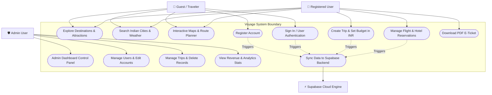
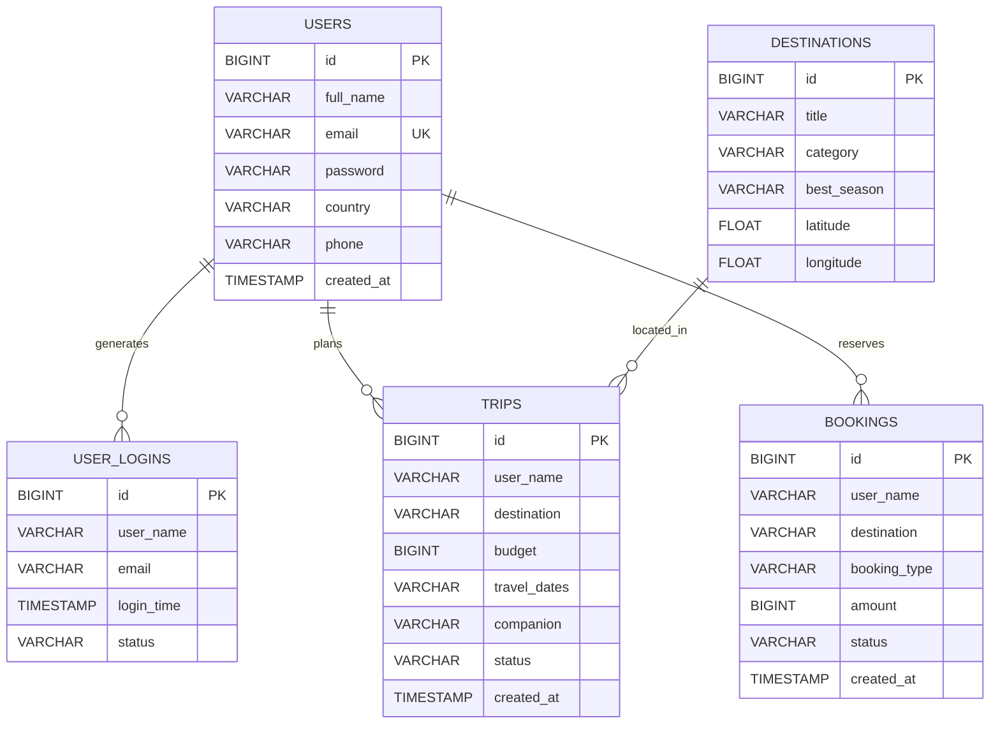
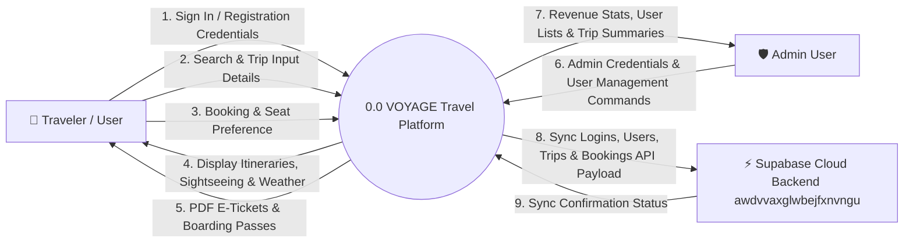
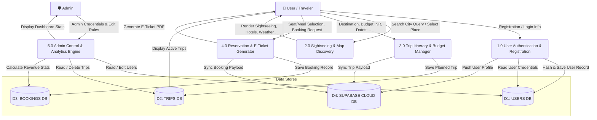

# SYSTEM ARCHITECTURE & DESIGN DIAGRAMS
## Project Name: VOYAGE — Travel Planning & Sightseeing Explorer Platform
**Repository:** [pranaykumarsingh06/Mini-Project](https://github.com/pranaykumarsingh06/Mini-Project)  

---

## 📌 OVERVIEW

This document presents the complete Unified Modeling Language (UML) and structured design diagrams for the **VOYAGE Travel Web Application**:
1. **Use Case Diagram** — Defines system boundary, user interactions, actor roles, and administrative functions.
2. **Entity-Relationship (ER) Diagram** — Mappings, schemas, attributes, primary/foreign keys, and relational cardinalities.
3. **Data Flow Diagrams (DFD)** — Context Diagram (Level 0) and Process Decomposition Diagram (Level 1).

---

## 1. USE CASE DIAGRAM

The Use Case Diagram highlights the interaction between system actors (**General Traveler**, **Registered User**, **Admin User**, **Supabase Backend**) and system capabilities.

### 1.1 Mermaid Use Case Visualizer

### 1.2 Use Case Specification Table

| Use Case ID | Use Case Name | Primary Actor | Description | Pre-conditions |
| :--- | :--- | :--- | :--- | :--- |
| **UC-01** | Explore Destinations | Guest / User | View top 6 sightseeing spots, weather, best season, hotels, and restaurants per city. | None |
| **UC-02** | Interactive Route Planner | Guest / User | Compute travel route and distance between two Indian cities on map. | Open `/map` page |
| **UC-03** | User Registration | Guest | Create new account with email, full name, password, country, and phone. | Form filled |
| **UC-04** | User Sign In | Guest / User | Authenticate user using email/name and password hash verification. | Valid account |
| **UC-05** | Plan Trip & Budget | Registered User | Set destination, budget in ₹ INR, travel dates, and companion style. | Logged in |
| **UC-06** | Manage Reservation | Registered User | Customize seat preference, meal selection, or request cancellation. | Active booking |
| **UC-07** | Download E-Ticket | Registered User | View printable E-Ticket with PNR, flight details, and barcode. | Active booking |
| **UC-08** | Admin Governance | Admin User | Access `/admin` dashboard to add/edit/delete users, trips, and view stats. | Logged in as `pranaykrsingh03@gmail.com` |
| **UC-09** | Cloud Sync | System | Asynchronously push logins, users, trips, and bookings to Supabase PostgreSQL. | Action executed |

---

## 2. ENTITY-RELATIONSHIP (ER) DIAGRAM

The ER Diagram illustrates the database structure, logical schema attributes, primary keys (`PK`), foreign keys (`FK`), and cardinalities across local SQLite3 and Supabase PostgreSQL backend.

### 2.1 Mermaid ER Diagram

### 2.2 Relational Schema Definitions

1. **`USERS` Table**:
   - `id` (PK, AUTO_INCREMENT): Unique user identifier.
   - `full_name` (NOT NULL): User's display name.
   - `email` (UNIQUE, NOT NULL): Account login email address.
   - `password` (NOT NULL): SHA-256 encrypted password hash.
   - `country`, `phone`: Contact metadata.
   - `created_at`: Account registration timestamp.

2. **`USER_LOGINS` Table**:
   - `id` (PK), `user_name`, `email`, `login_time`, `status`.

3. **`TRIPS` Table**:
   - `id` (PK), `user_name`, `destination`, `budget` (₹ INR), `travel_dates`, `companion`, `status`, `created_at`.

4. **`BOOKINGS` Table**:
   - `id` (PK), `user_name`, `destination`, `booking_type` (*Hotel & Flight / Package*), `amount` (₹ INR), `status`, `created_at`.

---

## 3. DATA FLOW DIAGRAMS (DFD)

Data Flow Diagrams map the flow of data through the VOYAGE system, showing inputs, processes, outputs, and data stores.

### 3.1 DFD Level 0 (Context Diagram)

The Level 0 DFD defines the entire system boundary, external entities (**Traveler**, **Admin**, **Supabase Service**), and top-level data flows.

---

### 3.2 DFD Level 1 (Process Decomposition Diagram)

The Level 1 DFD decomposes the system into 5 primary operational sub-processes.

---

## 4. SUMMARY OF DIAGRAM COMPLIANCE

| Diagram Type | Representation | Purpose | Verification Status |
| :--- | :--- | :--- | :---: |
| **Use Case Diagram** | UML / Mermaid Flow | Illustrates actor interactions, system boundaries, and security rules. | ✅ Verified |
| **ER Diagram** | Entity Relational Notation | Maps database tables, primary keys, foreign relations, and schema fields. | ✅ Verified |
| **DFD Level 0** | Context Data Flow | High-level data exchange between User, Admin, System, and Supabase Backend. | ✅ Verified |
| **DFD Level 1** | Process Decomposition | Detailed 5-process data transformations and DB read/write interactions. | ✅ Verified |

---
*Diagram Artifact Generated for VOYAGE Project Repository (`pranaykumarsingh06/Mini-Project`).*
