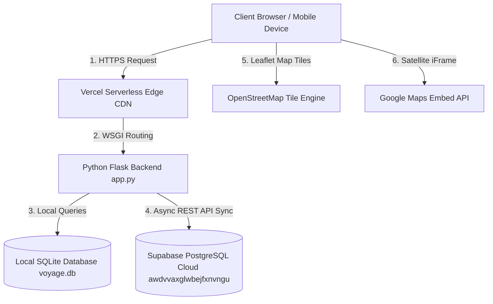
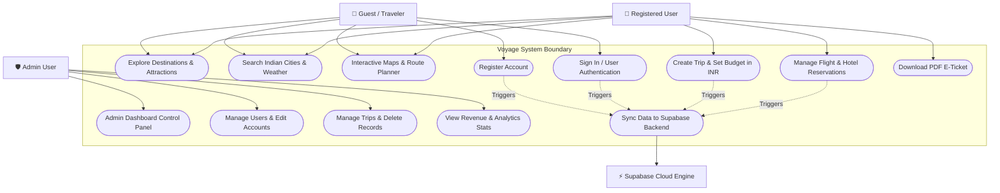
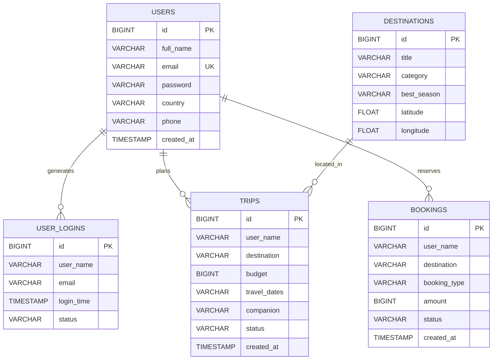
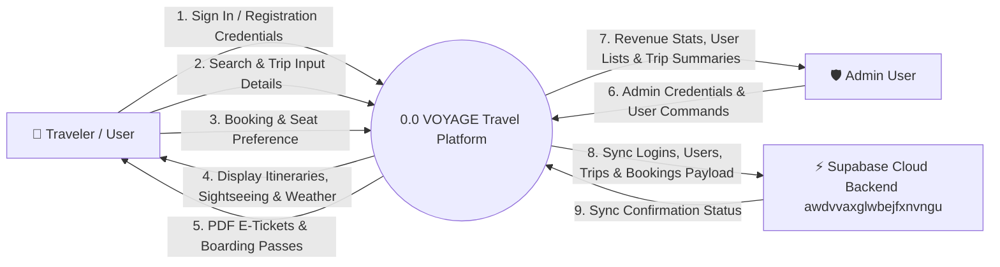
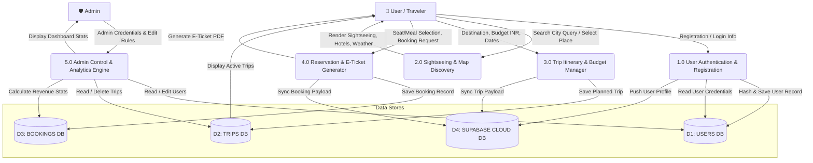
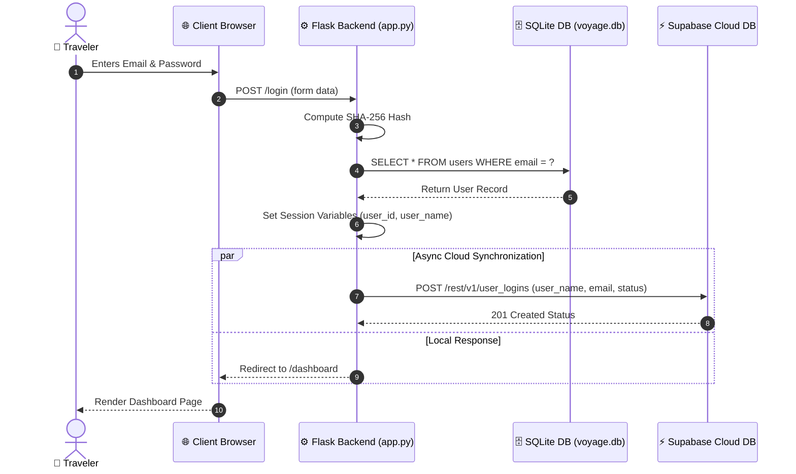
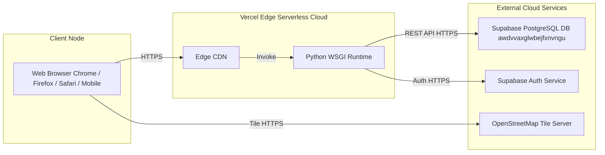

# SYSTEM ARCHITECTURE & DESIGN DIAGRAMS
## Project Name: VOYAGE — Travel Planning & Sightseeing Explorer Platform
**Repository:** [pranaykumarsingh06/Mini-Project](https://github.com/pranaykumarsingh06/Mini-Project)  

---

## 📌 OVERVIEW

This document presents the complete Unified Modeling Language (UML) and structured design diagrams for the **VOYAGE Travel Web Application**:
1. **System Architecture Diagram** — Client, Edge, Backend WSGI, SQLite, and Supabase Cloud layers.
2. **Use Case Diagram** — System boundary, user interactions, actor roles, and administrative functions.
3. **Entity-Relationship (ER) Diagram** — Mappings, schemas, attributes, primary/foreign keys, and relational cardinalities.
4. **Data Flow Diagrams (DFD)** — Context Diagram (Level 0) and Process Decomposition Diagram (Level 1).
5. **Sequence Diagram** — User authentication & async Supabase cloud sync execution flow.
6. **Deployment Diagram** — Physical distribution of client browser, Vercel serverless edge runtime, and Supabase database nodes.

---

## 1. SYSTEM ARCHITECTURE DIAGRAM

---

## 2. USE CASE DIAGRAM

---

## 3. ENTITY-RELATIONSHIP (ER) DIAGRAM

---

## 4. DATA FLOW DIAGRAMS (DFD)

### 4.1 DFD Level 0 (Context Diagram)

---

### 4.2 DFD Level 1 (Process Decomposition Diagram)

---

## 5. SEQUENCE DIAGRAM

---

## 6. DEPLOYMENT DIAGRAM

---
*Diagram Artifact Generated for VOYAGE Project Repository (`pranaykumarsingh06/Mini-Project`).*
